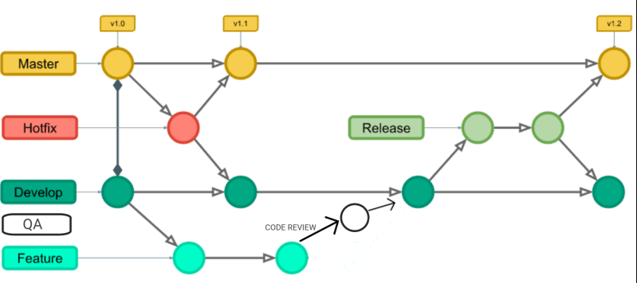

# Curso de React Native: criando um app
Neste repositório apresento a aplicação mobile de nome "Orgs Cesta", que simula a tela de um e-commerce que exibe uma lista de produtos para compra e ação de comprar a cesta de produtos.

Esta aplicação foi desenvolvida no "Curso de React Native: criando um app" da plataforma Alura.
- Neste curso:
  - Iniciei o aprendizado e a aplicação dos conceitos iniciais relacionados ao universo do React Native:
    - Limitações do Expo CLI x React Native CLI
    - Live Reloading
    - Componentes
    - Estilização
    - Google Fontes
  - Utilizei o Expo CLI para rodar a aplicação em meu próprio dispositivo móvel (e não precisar inicialmente de configurações complexas de ambiente de desenvolvimento com emuladores e etc.)
  - Analisei a estrutura de um projeto Expo:
    - package.json: contém as versões das bibliotecas utilizadas
    - app.json: apresenta as configurações do Expo para o aplicativo que está sendo trabalhado
    - App.js: porta de entrada da aplicação
    - /node_modules: contém os arquivos das bibliotecas definidas em "package.json"

Como o curso estava desatualizado, criei duas soluções, "old_expo_orgs_cesta" (que contém código gerado com os comandos antigos do Expo em conjunto com o Node v16.20.2) e "new_expo_orgs_cesta" (que contém código gerado com os comandos novos do Expo em conjunto com o Node v20.14.0).

---

# Ferramentas, Recursos e Processos Utilizados
- IDE: [Visual Studio Code](https://code.visualstudio.com/)
- Node: [Node.js v20.14.0](https://nodejs.org/en)
- Node: [Node.js v16.20.2](https://nodejs.org/en)
- Node Version Manager: [NVM](https://github.com/nvm-sh/nvm?tab=readme-ov-file#node-version-manager---)
  - Windows Subsytem for Linux: [WSL](https://learn.microsoft.com/pt-br/windows/wsl/install)
- Markdown + Visual Studio Code: [Markdown](https://code.visualstudio.com/docs/languages/markdown)
- Git Flow: Todos os conteúdos gerados neste repositório estão seguindo o modelo de fluxo de trabalho baseado no "Git Flow", conforme:

---

# Base de Conhecimento
## Dicas
- "./" quer dizer "a partir de onde eu estou"

## Conceitos
- npx: Gerenciador de pacotes do node para recursos REMOTOS
- npm: Gerenciador de pacotes do node para recursos LOCAIS
- JSX: "Mistura de Javascript com XML"

## Comandos Utilizados
### Preparação do Ambiente
- wsl --install
  - Para ativar o WSL no Windows
- curl -o- https://raw.githubusercontent.com/nvm-sh/nvm/v0.35.3/install.sh | bash
  - Para baixar o NVM (Node Version Manager)
- nvm ls-remote
  - Para listar as versões disponíveis para download do Node
- nvm install v16.20.2
  - Para instalar esta versão específica do Node
- nvm use 16.20.2
  - Para usar esta versão específica do Node
- nvm ls
  - Para listar as versões instaladas do Node
- node -v
  - Para verificar a versão do node que está sendo utilizada
- npm install -g expo-cli
  - Para instalar o Expo no Windows
  - OBS: este comando está desatualizado, pois as novas versões do Expo utilizam a abordagem Local com "NPX", sem a necessidade de instalar o mesmo globalmente
- expo --version
  - Para verificar a versão do Expo instalada no computador
  - OBS: este comando está desatualizado, pois as novas versões do Expo utilizam a abordagem Local com "NPX", sem a necessidade de instalar o mesmo globalmente

### Navegação no Terminal
- cd <nome_pasta>
  - Para acessar uma subpasta em relação a pasta atual
- ls
  - Lista todos os itens dentro da pasta atual
- cls
  - Para limpar o terminal

### Expo Go
- Ctrl + M
  - Abre o menu de configurações do Expo GO para a aplicação que está sendo executada

### React Native
- npm start
  - Para executar/rodar a aplicação criada
  - OBS: ao executar este comando, o mesmo será traduzido para o "expo start", conforme package.json

#### Expo "Antigo"
- expo init <nome_projeto>
   Para criar o projeto React Native com Expo CLI com um template padrão de organização de código e recursos
- expo install react-dom react-native-web @expo/metro-runtime
  - Para instalar os recursos necessários para rodar a aplicação em um navegador Web ao invés de em um emulador ou dispositivo físico com Expo Go

#### Expo "Novo"
- npx create-expo-app <nome_projeto> --template blank
  - Para criar o projeto React Native com Expo CLI com um template padrão de organização de código e recursos
- npx expo start
  - Para executar/rodar a aplicação criada
- npx expo install react-dom react-native-web @expo/metro-runtime
  - Para instalar os recursos necessários para rodar a aplicação em um navegador Web ao invés de em um emulador ou dispositivo físico com Expo Go

---

# Links Úteis
- Documentação do [React Native](https://reactnative.dev/docs/getting-started#function-components-and-class-components)
- Documentação do [Expo](https://docs.expo.dev/tutorial/introduction/)
  - Evolução "expo >>> npx expo" [Expo Local](https://blog.expo.dev/the-new-expo-cli-f4250d8e3421)